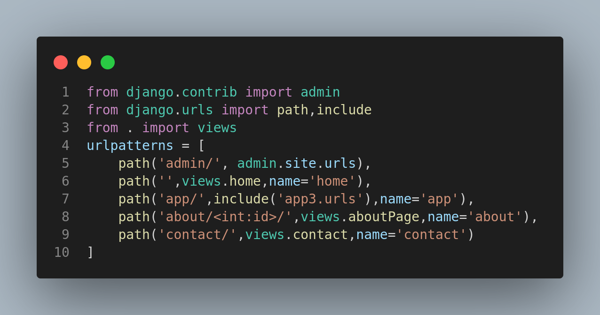

<h1 style="text-align:center;font-size:2.5rem;color:white" class="heading">Part-3 contains:</h1>
<ol>
        <li style="color: white;font-size: 1.5rem;">Static files</li>
        <li style="color: white;font-size: 1.5rem;">CSS framework adding</li>
        <li style="color: white;font-size: 1.5rem;">URL Tag</li>
        <li style="color: white;font-size: 1.5rem;">Template Inheritance</li>
</ol>
<hr>
<h1 class="heading">Static files:</h1>
<h3 class="details">Static files can be added in globally or app folder. Must change in settings.py file.</h3>

`Changes code`

```py

STATIC_URL = 'static/'
STATICFILES_DIRS=[BASE_DIR/'static'] 

```
```html

```

<h1 class="heading">CSS framework adding:</h1>
<h3 class="details">Same as static files. Just add CDN link on base.html</h3>

`Changes code`

```py

STATIC_URL = 'static/'
STATICFILES_DIRS=[BASE_DIR/'static'] 

```
```html
<link rel="stylesheet" href="">
```

#

<div id="urlTag">
<a href="#topic">Topic</a>
<h1>URL Tag:</h1>
<h3></h3>

`URL Tagging:`

`Syntax of urls.py:`



```html

<a class="nav-link active" aria-current="page" href="">Contact</a>

```

`urls.py:`

```py

from django.contrib import admin
from django.urls import path,include
from . import views
urlpatterns = [
    path('admin/', admin.site.urls),
    path('',views.home,name='home'),
    path('app/',include('app3.urls'),name='app'),
    path('about/',views.aboutPage,name='about'),
    path('contact/',views.contact,name='contact')
]

```

`views.py:`

```py

def aboutPage(request):
    return render(request,'index.html')

```

</div>

#

<div id="passValueInURL">
<a href="#topic">Topic</a>
<h1>Pass Value In URl:</h1>
<h3>Sample: `http://127.0.0.1:8000/about/1/` </h3> 

`urls.py:`

```py

path('about/<int:id>/',views.aboutPage,name='about'),

```   

<hr>

`views.py`

```py

def aboutPage(request,id):
    return render(request,'index.html',{'id':id})

```

`base.html`

```
<a class="nav-link" href="">About</a>

```

</div>

#

<h1 class="heading">Template Inheritance:</h1>
<h3 class="details">Two type of templates. 1. Parent templates (base.html), 2. Child templates.</h3>

`Sample code of base.html`
```html
<!DOCTYPE html>
<html lang="en">
<head>
    <meta charset="UTF-8">
    <meta name="viewport" content="width=device-width, initial-scale=1.0">
    <title>Document</title>
</head>
<body>
    
       Here, child template content will be written
    
</body>
</html>
```

`Sample code of child templplate`

```html



<h1> Hello Django </h1>


```

<!-- Template for readme -->
<!-- 
<h1 class="heading"></h1>
<ol class="topic-container">
        <li class="topic" style="color: white;font-size: 1.5rem;">Topic Name</li>
        <li class="topic" style="color: white;font-size: 1.5rem;">Topic Name</li>
        <li class="topic" style="color: white;font-size: 1.5rem;">Topic Name</li>
        <li class="topic" style="color: white;font-size: 1.5rem;">Topic Name</li>
</ol>
<h1 class="heading"></h1>
<h3 class="details"></h3>
<h1 class="heading"></h1>
<h3 class="details"></h3>
 -->